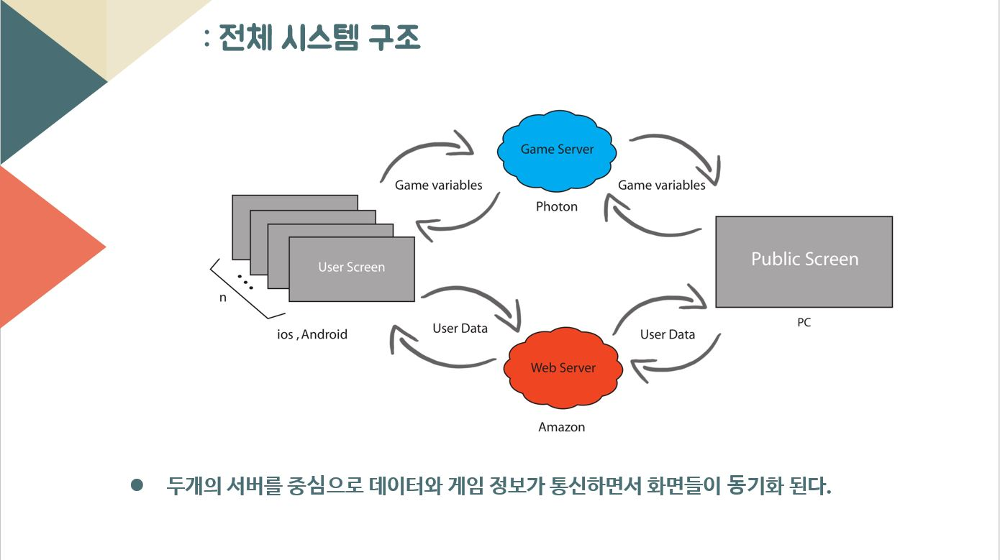
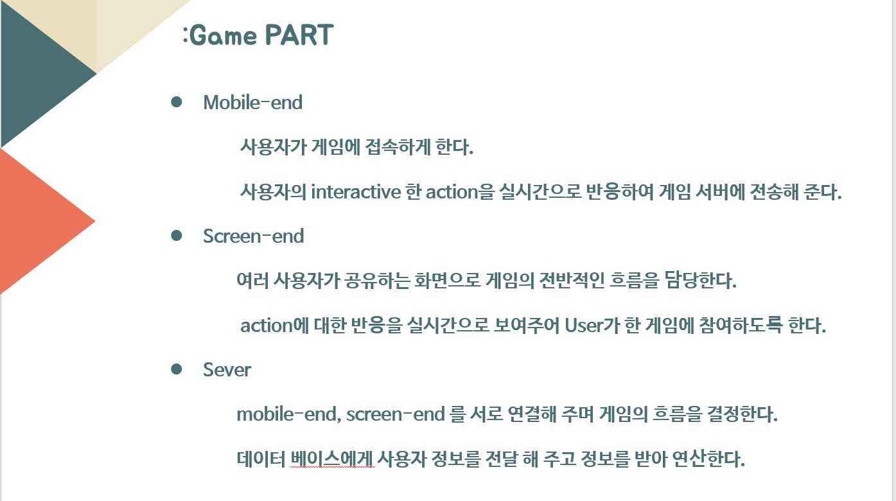
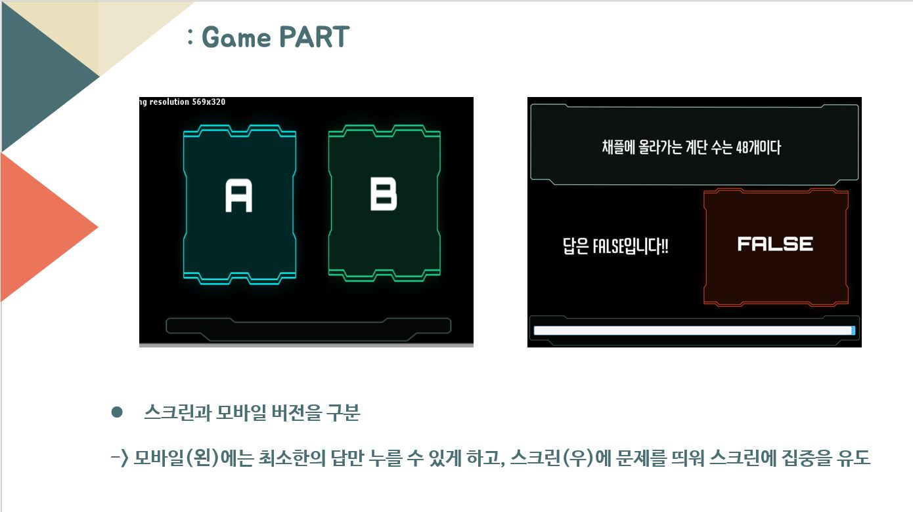
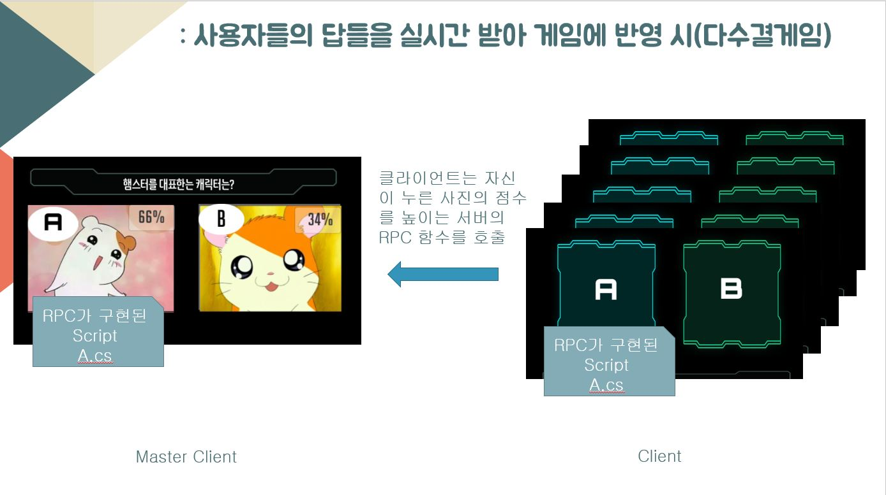
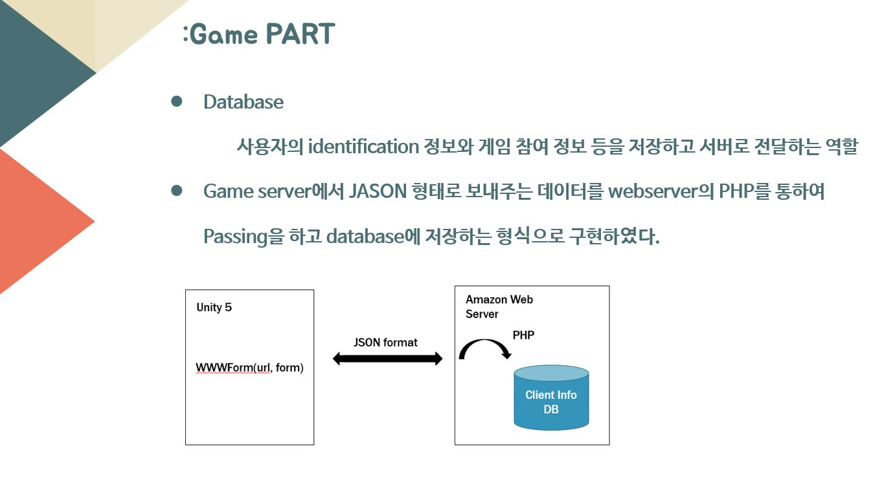
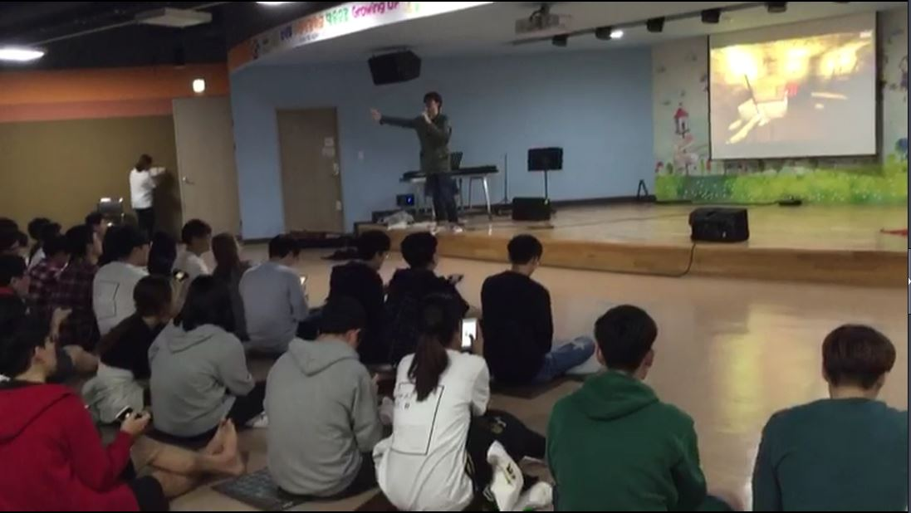
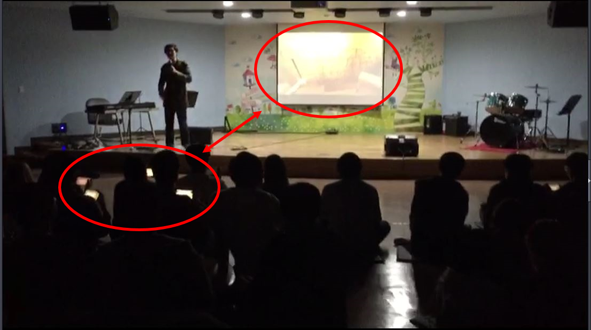

 On screen Advergame Application (온 스크린 광고형 게임)
=====================================

### On Screen? 
><b>Large screen that many people can share. In this project, we want to connect the smartphone application with the large screen.</b>
>
> 다수의 사람들이 공유할 수 있는 대형스크린을 의미한다. 해당 프로젝트에서는 스마트폰 어플을 대형 스크린과 연동하고자 한다.

### Advergame? (광고형 게임이란 ?)
> <b> Advergaming is a new advertising media that is being used by many companies to brand and market their products. </b>
>  
>  기존의 광고는 게임에  PPL형식으로 이루어 졌다면, 에드버게임은 광고 그 자체를 게임으로 만들어 소비자에게 접근한다.

----------

# Motivation & Solution
###Motivation
> <B>영화관람 전, 약 20분간 진행되는 무분별한 광고 상영시간.</B>
>  2015년, "영화 시작시각 넘긴 광고상영 부당" 소송이 제기됐다.  하지만 재판부는 영화관의 손을 들어주며 영화광고 시간을 줄일 수 없다고 판결을 내리며 소송을 기각한다.
> 
> <B> 지루하고 따분한 상영전 광고, 소비자는 참아야만 하는 걸까?</B>

###Solution
> <b> 피할 수 없으면 즐겨라</b>
> 광고를 소비자가 직접 즐기는 게임으로 만들수 있다면??!!!

><b> 광고가 게임이된다면?</b>
>
><li>  <b>소비자</b>는 게임을 통한 즐거움을 ! </li>
> <li> <b>광고주</b>는 상품에 대한 좋은 인식 재고 ! </li>
>  <li> <b>영화관</b>은 관람객들의 불만을 해결! </li>

----------

# Requirement list 
> <ol>
> <li>대형 스크린과 스마트 폰이 연동하여 하나의 게임을 구성한다.</li>
> <li>동시에 약 100명이 넘는 동시접속을 제공한다.</li>
> <li>게임은 남여노소 쉽게 이해할 수 있어야 한다.</li>
> <li>광고 효과를 창출할 수 있는 게임이어야 한다.</li>
> </ol>

## Used Tool 
> 1.  Unisy 5 
> 2. Photon Server 
> 3. AWS Server 
> 4. MySql
 

----------

# Implementation 

----------
# Prototype 
> **<b>한 동아리 MT에서 동아리 구성원들을 알리는 것을 주제로 약 100명을 대상으로 서비스 테스트 </b>**
> 
> 

>**<b>개인 스마트폰으로 스크린에 있는 게임에 참여하여 모두가 함께 즐길 수 있다</b>**
> 

# Feedback 

-  게임에 참여한 대부분의 사람이 게임을 통해 동아리 구성원을 더 잘 알게되었다고 답함.

- 퀴즈와 같은 정형화된 게임보다는 이상형 월드컵 처럼 다수에 의해 답이 정해질 수 있는 유동적인 게임을 더 선호함.  